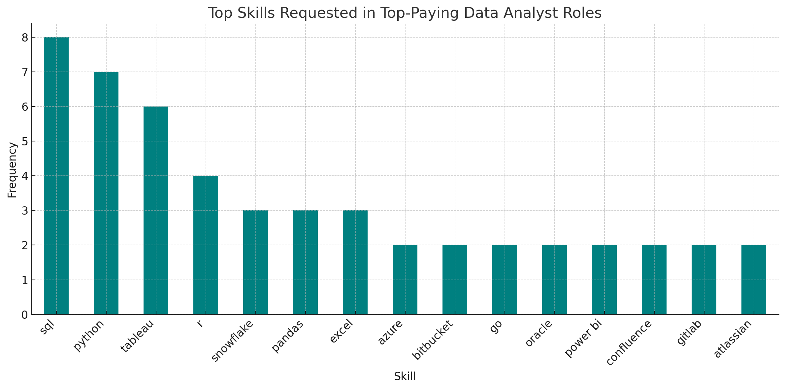
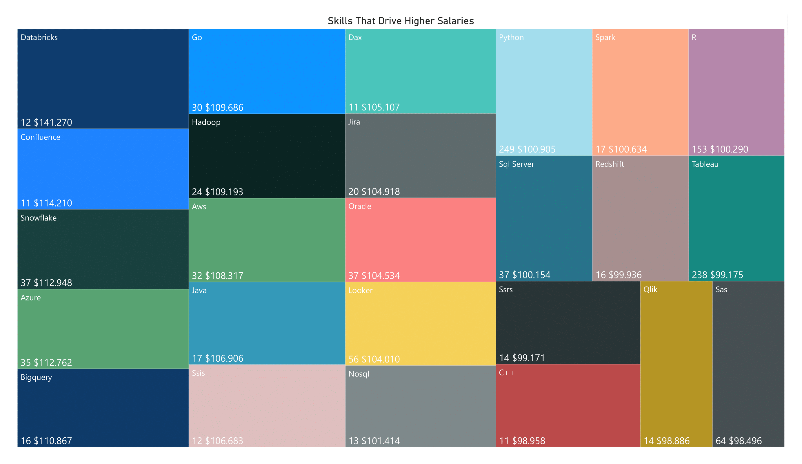

# Introduction
This project explores the **job market for Data Analysts in 2023**, focusing on opportunities in Portugal 🇵🇹 and remote roles worldwide 🌍. I analyzed:
- 💰 Salaries across different regions
- 🧠 In-demand skills for Data Analysts
- 🎯 Skill-to-salary alignment — which skills lead to better pay
The goal was to understand my current position in the market:
- ✅ Are my skills aligned with industry expectations?
- 🔄 How can I adapt my professional path to stay competitive?
This project is a personal deep dive into career strategy, using data to guide smart decisions in a fast-changing job landscape.

All queries used in this project are available here [project_sql folder](/project_sql/) for reference and reproducibility.

# Background
As a Data Analyst working to become more competitive, I wanted to better understand how my skills align with current market demands. Living in Portugal 🇵🇹, I was especially curious about how local job offers compare to remote opportunities worldwide 🌍.
With the growing demand for data professionals and increasing competition—driven by specialized skills and global remote hiring—I set out to explore whether Portugal is keeping pace and where the best opportunities might be.
This project helped me evaluate:
- 🔍 How my current skill set matches market expectations
- 📈 Which skills are most valued in Portugal vs remote roles
- 🌐 Where the most promising opportunities are located
A special thanks to Lukas Barousse, who provided guidance and access to the datasets. This was an incredible opportunity to apply my SQL skills to real-world data and deepen my understanding of the job market.

# Tools I Used
In this project, I used a few tools to help me run the analysis and answer my questions:
- **SQL** – My main tool for writing queries, exploring the data, and extracting insights.
- **PostgreSQL** – The database system I used to store and manage the job posting data.
- **Visual Studio Code** – This was my first time using VSC, and I was genuinely impressed. It's a powerful and flexible platform that made the entire process smoother—from writing queries to managing files and navigating the database. It definitely made the project easier and more enjoyable to work on.

These tools allowed me to work with real data and test my SQL skills in a practical, hands-on way.

# The Analysis

## 1. Which jobs have the biggest salaries?

Using this query, I identified the top 10 highest-paying Data Analyst roles across job postings in Portugal and remote positions worldwide. This gave me a clearer view of where the most lucrative opportunities are and what kind of roles offer the highest compensation:


```SQL
SELECT
    job_id,
    job_title,
    company_dim.name AS company_name,
    job_location,
    job_schedule_type,
    salary_year_avg,
    job_posted_date,
    job_country
FROM
    job_postings_fact
LEFT JOIN company_dim
    ON job_postings_fact.company_id = company_dim.company_id
WHERE
    job_title_short ='Data Analyst' AND
    (job_location ='Anywhere' OR job_country = 'Portugal') AND
    salary_year_avg IS NOT NULL
ORDER BY
    salary_year_avg DESC
LIMIT 10
```

- **India takes the top spot:** Despite 9 out of 10 companies being U.S.-based, the highest-paying role belongs to **Mantys**, an Indian company, offering a staggering **$650,000/year**—nearly double the second-highest salary.
- **Tech dominates the list:** Companies like **Meta**, **Pinterest**, **AT&T**, and **SmartAsset** reflect a strong presence of **tech and digital** services, showing that data roles in this sector command premium compensation.
- **Healthcare is competitive: Uclahealthcareers** offers **$217,000/year**, showing that healthcare analytics is also a high-paying niche within remote opportunities.
- **Leadership roles pay more:** Titles like Director, Principal, and Associate Director appear frequently, indicating that **senior-level positions** are driving the top salary range (most between **$184K–$336K/year**)

### 💼 Top-Paying Data Analyst Roles

| **Job Title**                                      | **Company**                                | **Business Area**         | **Salary (USD/year)** |
|----------------------------------------------------|---------------------------------------------|----------------------------|------------------------|
| Data Analyst                                       | Mantys                                      | Fintech / SaaS             | $650,000              |
| Director of Analytics                              | Meta                                        | Tech / Social Media        | $336,500              |
| Associate Director – Data Insights                 | AT&T                                        | Telecom / Tech             | $255,829              |
| Data Analyst, Marketing                            | Pinterest Job Advertisements                | Tech / Digital Marketing   | $232,423              |
| Data Analyst (Hybrid/Remote)                       | Uclahealthcareers                           | Healthcare                 | $217,000              |
| Principal Data Analyst (Remote)                    | SmartAsset                                  | Fintech / Personal Finance | $205,000              |
| Director, Data Analyst – HYBRID                    | Inclusively                                 | HR Tech / Accessibility    | $189,309              |
| Principal Data Analyst, AV Performance Analysis    | Motional                                    | Autonomous Vehicles / Tech | $189,000              |
| Principal Data Analyst                             | SmartAsset                                  | Fintech / Personal Finance | $186,000              |
| ERM Data Analyst                                   | Get It Recruit – Information Technology     | IT Recruitment / Consulting| $184,000              |

## 2. Which skills do I  need to apply for those jobs?

Once I had the top 10 best-paid jobs, I ran this query to check which skills were required for those roles. It gave me a clearer idea of what’s expected at the higher end of the market:

``` SQL

WITH top_paying_jobs AS (
    SELECT
        job_id,
        job_title,
        company_dim.name AS company_name,
        salary_year_avg,
        job_country
    FROM
        job_postings_fact
    LEFT JOIN company_dim
        ON job_postings_fact.company_id = company_dim.company_id
    WHERE
        job_title_short ='Data Analyst' AND
        (job_location ='Anywhere' OR job_country = 'Portugal') AND
        salary_year_avg IS NOT NULL
    ORDER BY
        salary_year_avg DESC
    LIMIT 10
)
SELECT 
    top_paying_jobs.*,
    skills
FROM top_paying_jobs
INNER JOIN skills_job_dim ON top_paying_jobs.job_id = skills_job_dim.job_id
INNER JOIN skills_dim ON skills_job_dim.skill_id = skills_dim.skill_id
ORDER BY
    salary_year_avg DESC
```
Among the top-paying Data Analyst roles ($184k–$255k), **SQL and Python were required in 100% of postings**. Visualization tools like **Tableau** appeared in **70% of jobs**, while **cloud platforms (AWS, Azure, Snowflake, Databricks) featured in nearly half**. Advanced roles combined these with **Excel, Power BI, and collaboration tools**, reflecting demand for both technical and business-facing skills.



*Bar chart based on SQL query results, showing the most common skills among the 10 highest-paying job postings; Graph generated by ChatGPT.*
## 3. TOP 5 more requested skills for Data Analysis

This query allowed me to see which skills appear most often in Data Analyst roles. It gave me a clearer idea of which areas are worth prioritizing to stay aligned with market expectations:

``` SQL
SELECT
    skills,
    COUNT(skills_job_dim.job_id) AS demand_count
FROM job_postings_fact
INNER JOIN skills_job_dim ON job_postings_fact.job_id = skills_job_dim.job_id
INNER JOIN skills_dim ON skills_job_dim.skill_id = skills_dim.skill_id
WHERE job_title_short = 'Data Analyst'AND 
    (job_work_from_home = TRUE OR job_country = 'Portugal')
GROUP BY
    skills
ORDER BY
    demand_count DESC
LIMIT 5
```
Whether looking at remote roles or the Portuguese market, the top five skills for Data Analyst positions in 2023 remain consistent—**SQL**, **Excel**, **Python**, **Tableau**, and **Power BI**. **SQL stands out as the undisputed leader**, reinforcing the ongoing importance of strong data processing capabilities in analytical work.
While the core skills overlap, there are subtle differences in emphasis: **remote roles tend to prioritize spreadsheet manipulation (Excel)**, whereas **Portuguese listings lean more toward programming-based analysis (Python)**.
The top three skills suggest that **extracting and structuring information is valued more than visual presentation**, though data visualization remains a relevant and sought-after competency.


| Skill        | Remote & Portugal | Remote | Portugal |
| ------------ | --------- | --------- | --------- |
| **SQL**      | 9,138     | 7,291     | 1,951     |
| **Excel**    | 5,713     | 4,611     | 1,143     |
| **Python**   | 5,534     | 4,330     | 1,266     |
| **Tableau**  | 4,540     | 3,745     | 837       |
| **Power BI** | 3,545     | 2,609     | 975       |

*Table with the 5 most demanded skills across the three scenarios*

## 4. TOP 5 more requested skills for Data Analysis

This query helped me uncover the five most mentioned skills in Data Analyst job offers, giving me a clearer picture of what employers are looking for in Portugal and remote positions:

``` SQL
SELECT
    skills,
    COUNT(skills_job_dim.job_id) AS demand_count
FROM job_postings_fact
INNER JOIN skills_job_dim ON job_postings_fact.job_id = skills_job_dim.job_id
INNER JOIN skills_dim ON skills_job_dim.skill_id = skills_dim.skill_id
WHERE job_title_short = 'Data Analyst'AND 
    (job_work_from_home = TRUE OR job_country = 'Portugal')
GROUP BY
    skills
ORDER BY
    demand_count DESC
LIMIT 5
```

### 📊Skill & Salary Comparison Across Markets##

When comparing the top 25 highest-paying skills for Data Analyst roles, I chose to take a broader approach. Instead of limiting the analysis to a fixed list, I extracted and compared results from three distinct scenarios:
- 🌍 Global (Remote + Portugal)
- 🏠 Remote Only
- 🇵🇹 Portugal Only
Due to variations in demand across these markets, the final list includes **39 unique skills**, offering a more complete view of how compensation and tooling differ by region

### 🌍 Why Are the Results So Different?
- **Global Remote Roles** tend to be offered by large international companies with advanced data infrastructures. These roles frequently require tools like **PySpark**, **Databricks**, **Airflow**, and **GitLab**—technologies used in big data pipelines, cloud platforms, and machine learning workflows.
- **Portugal-Based Roles** prioritize more traditional enterprise tools such as **SQL Server**, **Power BI**, **Excel**, and compliance-related skills. These reflect the needs of local businesses, often focused on reporting, BI dashboards, and regulatory data handling.
- **Salary differences** reflect this gap:
Remote roles offer up to **$200K+**, while Portuguese listings top out around **$165K**, with many falling below **$100K**.

### ✅ Key Takeaways

- Only **4 skills**—**Pandas**, **Databricks**, **Scikit-learn**, and **Git**—appeared **in all three salary datasets**, making them strong candidates for cross-market relevance.
- Foundational tools like **SQL and Excel are widely used** but don’t always command the highest salaries.
- Specialized platforms and cloud tools are more likely to drive compensation in remote roles.
- Portugal’s market is more conservative but still values technical proficiency and regulatory awareness.


### 💼 Salary Comparison by Skill Across Markets

| **Skill**         | **Global Salary ($)** | **Remote Salary ($)** | **Portugal Salary ($)** |
|-------------------|------------------------|------------------------|--------------------------|
| PySpark           | 208,172                | 208,172                | —                        |
| Bitbucket         | 189,155                | 189,155                | —                        |
| GDPR              | 165,000                | —                      | 165,000                  |
| Couchbase         | 160,515                | 160,515                | —                        |
| Watson            | 160,515                | 160,515                | —                        |
| DataRobot         | 155,486                | 155,486                | —                        |
| GitLab            | 154,500                | 154,500                | —                        |
| Swift             | 153,750                | 153,750                | —                        |
| **Pandas**            | **143,929**                | **151,821**                | **72,900**                   |
| Golang            | 145,000                | 145,000                | —                        |
| Numpy             | 143,513                | 143,513                | —                        |
| **Databricks**        | **141,270**                | **141,907**                | **138,088**                  |
| Linux             | 136,508                | 136,508                | —                        |
| Jupyter           | 132,807                | 152,777                | —                        |
| Kubernetes        | 132,500                | 132,500                | —                        |
| Atlassian         | 131,162                | 131,162                | —                        |
| Twilio            | 127,000                | 127,000                | —                        |
| Airflow           | 126,103                | 126,103                | —                        |
| Jenkins           | 125,436                | 125,436                | —                        |
| Notion            | 125,000                | 125,000                | —                        |
| Scala             | 124,903                | 124,903                | —                        |
| PostgreSQL        | 123,879                | 123,879                | —                        |
| GCP               | 122,500                | 122,500                | —                        |
| MicroStrategy     | 121,619                | 121,619                | —                        |
| Git               | 120,833                | —                      | 165,000                  |
| Elasticsearch     | —                      | 145,000                | —                        |
| Scikit-learn      | —                      | 125,781                | 72,900                   |
| Azure             | —                      | —                      | 165,000                  |
| SQL Server        | —                      | —                      | 141,595                  |
| SAP               | —                      | —                      | 127,050                  |
| BigQuery          | —                      | —                      | 116,125                  |
| VBA               | —                      | —                      | 111,175                  |
| DAX               | —                      | —                      | 111,175                  |
| Spark             | —                      | —                      | 105,694                  |
| Looker            | —                      | —                      | 105,514                  |
| SQL               | —                      | —                      | 102,018                  |
| Tableau           | —                      | —                      | 95,945                   |
| R                 | —                      | —                      | 94,118                   |
| Python            | —                      | —                      | 91,966                   |
| Qlik              | —                      | —                      | 89,204                   |
| Power BI          | —                      | —                      | 87,073                   |
| GitHub            | —                      | —                      | 81,052                   |
| Word              | —                      | —                      | 80,850                   |
| HTML              | —                      | —                      | 80,850                   |
| JavaScript        | —                      | —                      | 80,850                   |
| Excel             | —                      | —                      | 80,290                   |
| SAS               | —                      | —                      | 72,900                   |

💡 *Note: A dash (—) means the skill did not appear in the top-paying list for that scenario.*

## 5. Skills That Drive Higher Salaries

 I used the following query to list skills ordered by average salary in descending order. This helps highlight which skills tend to appear in higher-paying job offers—but it doesn’t necessarily reflect overall demand or frequency. The goal was to understand which skills are most associated with top compensation:

``` SQL
SELECT
    skills,
    COUNT(skills_job_dim.job_id) AS demand_count
FROM job_postings_fact
INNER JOIN skills_job_dim ON job_postings_fact.job_id = skills_job_dim.job_id
INNER JOIN skills_dim ON skills_job_dim.skill_id = skills_dim.skill_id
WHERE job_title_short = 'Data Analyst'AND 
    (job_work_from_home = TRUE OR job_country = 'Portugal')
GROUP BY
    skills
ORDER BY
    demand_count DESC
LIMIT 5
```

The results show a clear divide between **high-demand foundational tools** and **specialized technologies with premium pay**.
- **Specialized tools like Databricks and Snowflake** offer the **highest salaries** (up to $141K) despite **lower demand**, suggesting companies pay more for niche expertise in cloud and big data platforms.
- **Core analytics tools like Python, Tableau, and R** dominate in demand but offer **mid-range salaries**, reflecting their widespread use across industries.
- **Enterprise and BI tools** (SSIS, DAX, Qlik, SAS) show **moderate demand and compensation**, often tied to legacy systems or specific business environments.
Overall, the data suggests that **specialization drives salary**, while **foundational skills ensure employability**. 



*Treemap listing all the skills by salary. Each block shows the skill name in the top-left corner, followed by its demand count and average salary in the bottom-left, with block size proportional to demand multiplied by salary.

This project helped me grow not only as a Data Analyst but also as a problem-solver. Each query was a chance to explore the data, refine my logic, and strengthen my SQL skills. Working with real datasets pushed me to think critically and use SQL to uncover insights that go beyond surface-level analysis.


# What I Learned

- **Translating Questions into Queries:** I learned how to turn practical questions—like salary trends and skill demand—into structured SQL logic using filters, joins, and conditional clauses.
- **Mastering Core SQL Techniques:** I practiced using GROUP BY, aggregate functions (AVG(), COUNT()), subqueries, and WITH clauses (CTEs) to organize and extract insights from complex datasets.
- **Working with PostgreSQL in VSC:** This was my first time using Visual Studio Code, and it proved to be a powerful and intuitive environment for managing SQL scripts and interacting with PostgreSQL.
- **Interpreting Results in Context:** Beyond writing queries, I improved my ability to interpret the data meaningfully—understanding not just what the numbers say, but what they imply for career strategy and market positioning.

## Insights:

**Highest-Paying Data Analyst Jobs**
- The top 10 highest-paying Data Analyst roles were all remote, with salaries ranging from $184,000 to $650,000 per year. None of these roles were based in Portugal, and 90% were offered by U.S. companies. This highlights the earning potential of remote positions and the gap between local and global opportunities.

**Key Skills Required for High-Paying Roles**
- Among the top-paying Data Analyst roles ($184k–$255k), SQL and Python were required in 100% of postings. Visualization tools like Tableau appeared in 70% of jobs, while cloud platforms (AWS, Azure, Snowflake, Databricks) featured in nearly half. Advanced roles combined these with Excel, Power BI, and collaboration tools, reflecting demand for both technical and business-facing skills.

**Top 5 In-Demand Data Skills**
- The five most requested skills for Data Analyst roles—whether remote or based in Portugal—are SQL, Excel, Python, Tableau, and Power BI. While the ranking differs slightly between locations, the core skill set remains consistent. SQL leads with over 9,000 mentions, confirming its central role in data analysis

**Most Demanded Skills for Data Analysts**
- The highest-paying skills for Data Analyst roles—whether remote or in Portugal—include PySpark, Bitbucket, and GDPR, with salaries reaching up to $208K/year. While the ranking varies by location, many top-paying skills like Databricks, Git, and Pandas appear across both markets. This shows that specialized tools and platforms often command higher compensation.

**Skills Linked to Top Salaries**
- Among Data Analyst roles in Portugal and remote positions, the highest-paying skills with notable demand include Databricks ($141K), Snowflake ($113K), and Azure ($113K). Widely requested tools like Python, Tableau, and R also appear, showing that both niche platforms and core analytics skills contribute to strong earning potential.

# Conclusions
This project helped me explore real market data, sharpen my SQL skills, and uncover valuable insights about the Data Analyst job landscape. Working with tools like Excel, SQL, Python, and Power BI confirmed that I’m on the right path—building a skill set that aligns with industry needs and supports my long-term goals. While I’ve reached meaningful conclusions for now, there’s still a lot more to uncover. I plan to revisit this project in the future as my skills evolve and new questions arise, continuing to grow both my portfolio and my perspective.
